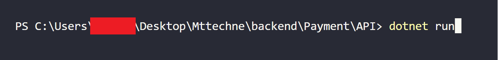

# Projeto criado para participar do processo seletivo da Mttechne

## Requisitos da aplicação backend
    Visual Studio 2022 ou Visual Studio Code
    .NET 6.x (ou posterior)

## Executar aplicação
    Visual Studio 2022

    Verifique se o projeto de API está selecionado como startup 
    Se não estiver basta selecionar dessa forma:

##
    Para iniciar a aplicação basta clicar aqui:

##  
    Visual Studio Code
    
    Abra um terminal na pasta do projeto de API e execute o comando:

    dotnet run

