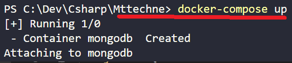
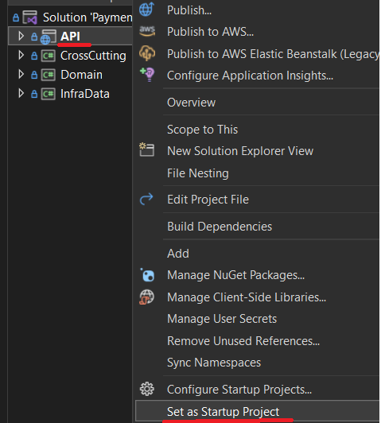
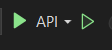
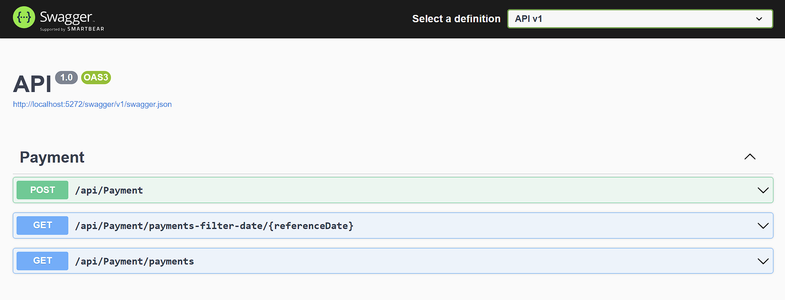
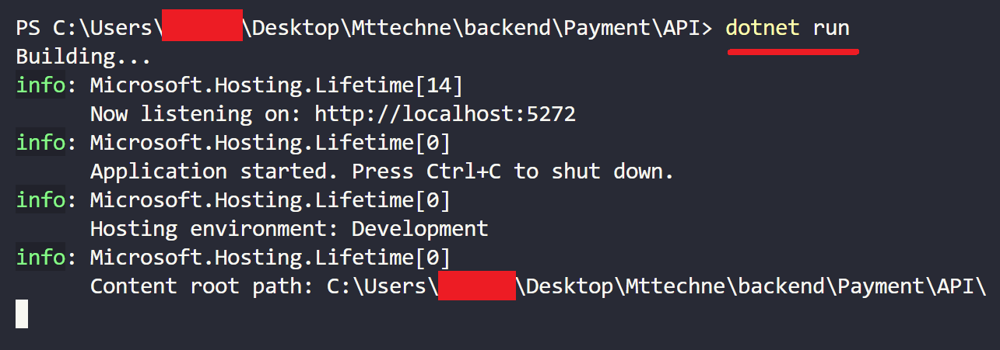

## Requisitos da aplicação backend
    Visual Studio 2022 ou Visual Studio Code
    .NET 6.x (ou posterior)
    docker (opcional)

## Observação:
    Estou utilizando o banco de dados MongoDB na nuvem usando a plataforma MongoDB Atlas.
    Caso queira utilizar local, execute o seguinte comando:

    docker-compose up
    
    Executando local a aplicação não terá dados no banco, será necessário adicionar.

## Observação:
    Será necessário trocar a string de conexão, como na imagem:

## Executar aplicação
    Visual Studio 2022

    Verifique se o projeto de API está selecionado como startup 
    Se não estiver basta selecionar dessa forma:

##
    Para iniciar a aplicação basta clicar aqui:

## 
    Essa tela será exibida

##  
    Visual Studio Code
    
    Abra um terminal na pasta do projeto de API e execute o comando:

    dotnet run

##
    Acesse: http://localhost:5272/swagger/index.html
