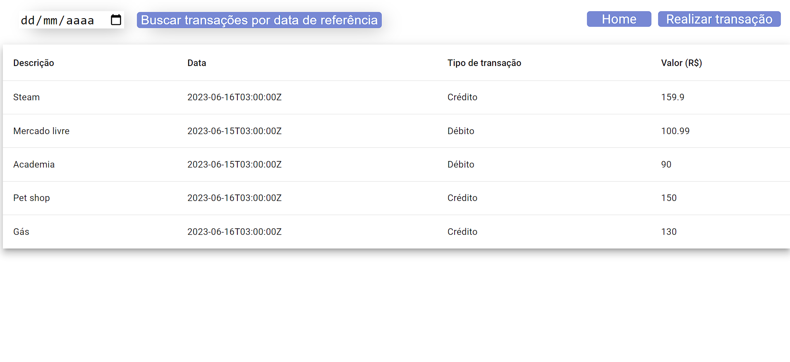

## Requisitos da aplicação frontend
  Angular versão 16 ou posterior

##
  Execute o comando

  npm install (para baixar as dependências usadas no projeto)

##
  OBS: Execute o backend primeiro

  Após a instalação dos pacotes execute o seguinte comando para executar a aplicação

  ng serve -o

## 
  Essa tela será exibida

